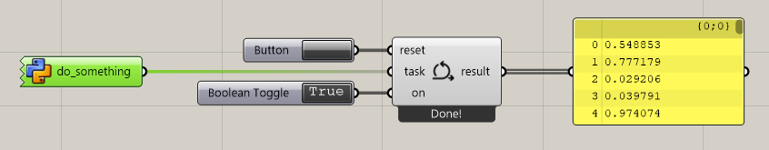

# Grasshopper Integration

!!! note
    This tutorial assumes that you have already installed `compas_eve`.
    If you haven't, please follow the instructions in the [installation](installation.md) section.

**COMPAS EVE** provides tools to work with events inside Rhino/Grasshopper, as well as
the ability to run long-running tasks in the background, which would otherwise block the UI.

## Long-running tasks

A long-running task is any snippet of code that takes a long time to execute. Normally, this would
freeze the Grasshopper user interface. **COMPAS EVE** provides a mechanism to run such tasks in the
background, so that the user can continue working with Grasshopper while the task is running.

In order to use it, add a `Background task` component to your Grasshopper definition, and connect
an input with a python function containing the code that needs to run in the background. The only
requirement is that this function must accept a `worker` argument, which is an instance of
[BackgroundWorker](compas_eve.ghpython.BackgroundWorker).



The following code exemplifies how to use it to create a simple background task that generates
a list of random values. The function adds some delay to simulate a long-running task.

```python
    import time
    import random

    def do_something(worker):
        result = []

        for i in range(100):
            result.append(random.random())
            worker.display_progress(len(result) / 100)
            time.sleep(0.05)

        worker.display_message("Done!")

        return result
```

It is also possible to update the results during the execution of the task. The result
can be of any type, in the previous example it was a list of numbers.

In the following example, the code generates a list of randomly placed Rhino points
and continuously updates the results as the list grows. The points will appear
in the Rhino Viewport even before the task has completed.

```python
    import time
    import random
    import Rhino.Geometry as rg

    def do_something(worker):
        result = []

        for i in range(100):
            x, y = random.randint(0, 100), random.randint(0, 100)
            result.append(rg.Point3d(x, y, 0))
            worker.update_result(result)
            time.sleep(0.01)

        worker.display_message("Done!")

        return result
```

## Components

The following components are available in Grasshopper:

| Icon | Component | Description |
| :---: | --------- | ----------- |
|  | `MqttConnect` | Connects to an MQTT broker. |
|  | `ZenohConnect` | Connects to a Zenoh router. |
|  | `Message` | Creates a new `compas_eve` message. |
|  | `Publish` | Publishes a message to a specific topic. |
|  | `Subscribe` | Subscribes to a specific topic. |
|  | `BackgroundTask` | Runs a function continuously in the background. |
