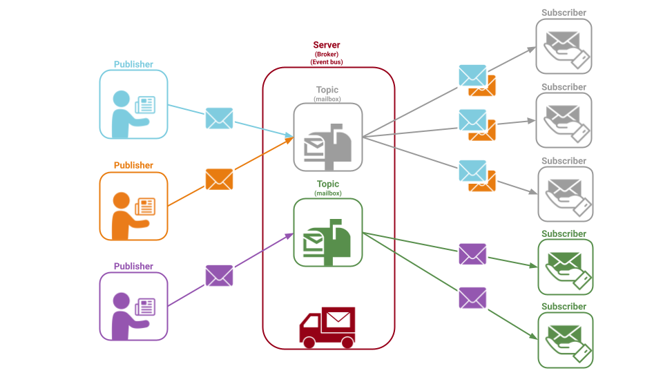

# Event Extensions for COMPAS

`compas_eve` adds event-based communication infrastructure to the COMPAS framework.
Using events is a way to decouple the components of a system, making it easier to develop, test, and maintain.



```pycon
>>> import compas_eve as eve
>>> pub = eve.Publisher("/hello_world")
>>> sub = eve.Subscriber("/hello_world", print)
>>> sub.subscribe()
>>> for i in range(10):
...    pub.publish(dict(text=f"Hello World {i}"))
```
